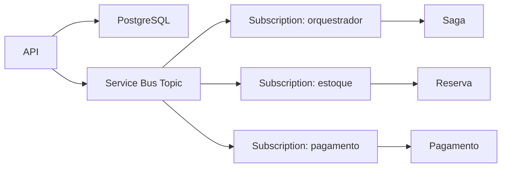

# EventDriven no BlogSamples

Este laboratório local demonstra uma saga orquestrada simples com PostgreSQL e Azure Service Bus Emulator, usando o padrão Outbox + Inbox para reduzir perdas e duplicidades.

## Arquitetura



## Pré-requisitos

- Docker Desktop ou Docker Engine com Compose
- .NET 10 SDK
- 2 GB de RAM livres
- WSL 2 no Windows, quando aplicável

## Subida local

```bash
docker compose -f src/BlogSamples/Messaging/EventDriven/docker-compose.yml up -d
```

Copie o arquivo de exemplo para `.env` e ajuste as senhas conforme necessário.

## Endpoint

```bash
curl -X POST http://localhost:5000/event-driven/pedidos \
  -H 'Content-Type: application/json' \
  -d '{"clienteId":"c1","valor":100.00}'
```

Consultar estado do outbox:

```bash
curl "http://localhost:5000/event-driven/outbox?limit=20"
curl "http://localhost:5000/event-driven/outbox?status=Pendente&limit=20"
curl "http://localhost:5000/event-driven/outbox?status=Publicado&limit=20"
curl "http://localhost:5000/event-driven/outbox?status=Falha&order=asc&limit=20"
```

Paginação por cursor (keyset por `created_at` + `id`):

```bash
# 1) primeira página
curl "http://localhost:5000/event-driven/outbox?limit=2&order=desc"

# 2) use NextCursorCreatedAt e NextCursorId retornados na resposta
curl "http://localhost:5000/event-driven/outbox?limit=2&order=desc&cursorCreatedAt=2026-07-26T20:40:10.1234567%2B00:00&cursorId=9f3b7fc6-ef7c-4c8f-8dba-1fb65d70f6de"
```

Valores aceitos em `order`: `desc` (padrão) e `asc`.

## Observações

- O PostgreSQL é o banco da aplicação.
- O SQL Server é uma dependência do emulador do Service Bus.
- O emulador é efêmero; o PostgreSQL persiste em volume nomeado.

## Outbox transacional e dual write

Este sample implementa o fluxo clássico de Outbox transacional para evitar dual write:

1. O endpoint `POST /event-driven/pedidos` inicia uma transação no PostgreSQL.
2. Na mesma transação, persiste o estado do pedido (`eventdriven_pedidos`) e as intenções de publicação (`eventdriven_outbox`).
3. Só depois do `COMMIT` a operação é considerada confirmada.
4. Um worker separado (`OutboxPublisherWorker`) busca mensagens pendentes com `FOR UPDATE SKIP LOCKED`.
5. O worker publica no broker (Service Bus Emulator) e só então marca o registro como `Publicado`.

Se a publicação falhar, o registro volta para `Pendente` com retry/backoff. Assim, o sistema evita afirmar que publicou quando ainda não publicou de fato.
