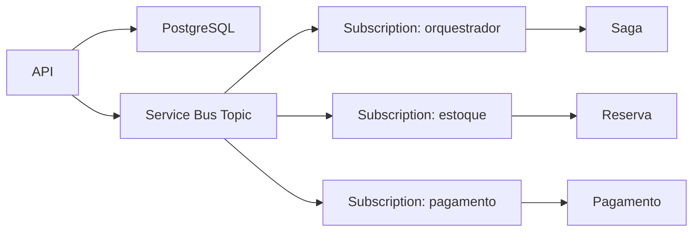

# EventDriven no BlogSamples

Este laboratório local demonstra uma saga orquestrada simples com PostgreSQL e Azure Service Bus Emulator, usando o padrão Outbox + Inbox para reduzir perdas e duplicidades.

## Arquitetura



## Pré-requisitos

- Docker Desktop ou Docker Engine com Compose
- .NET 10 SDK
- 2 GB de RAM livres
- WSL 2 no Windows, quando aplicável

## Subida local

```bash
docker compose -f src/BlogSamples/Messaging/EventDriven/docker-compose.yml up -d
```

Copie o arquivo de exemplo para `.env` e ajuste as senhas conforme necessário.

## Endpoint

```bash
curl -X POST http://localhost:5000/event-driven/pedidos \
  -H 'Content-Type: application/json' \
  -d '{"clienteId":"c1","valor":100.00}'
```

## Observações

- O PostgreSQL é o banco da aplicação.
- O SQL Server é uma dependência do emulador do Service Bus.
- O emulador é efêmero; o PostgreSQL persiste em volume nomeado.
